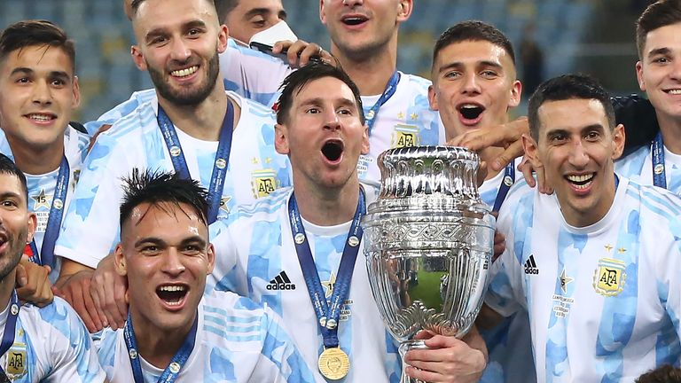

# tableau performances
Argentinian sport it is not only about football and Messi. Just look and this: [Tableau Public dashboard](https://public.tableau.com/views/ArgentinainBigSportDashboard/Dashboard1?:language=en-US&publish=yes&:sid=&:display_count=n&:origin=viz_share_link)

Argentina's sporting landscape extends far beyond the realm of football and the legendary figure of Messi. While football undoubtedly holds a special place in the hearts of Argentinians, the country boasts a rich and diverse sporting culture that includes a variety of disciplines.

From the graceful strides of polo to the fierce competition of basketball, Argentina celebrates sports of all kinds. Notably, Argentinian women have excelled in swimming, tennis, and basketball, shining brightly on the global stage.

What's truly impressive is the average age of athletes in Argentina, with women averaging 36 years and men nearly 40 years. This statistic reflects a culture where individuals continue to prioritize health and fitness throughout their lives, demonstrating that age is no barrier to sporting excellence.

To further explore Argentina's sporting trends and data, check out our Python analysis in this [Google Colab file](https://colab.research.google.com/drive/1thdzKph-BroBhyb8znAXsTSS17MetneM?usp=sharing).

